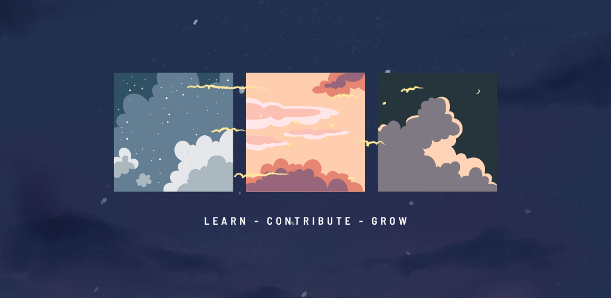

<h1 align="center"> Hi there 👋</h1>

<!-- My name is Aman Negi and I am a computer science student. I have a strong interest in mobile development and have developed several projects using Flutter and Android. I am currently expanding my skills by learning ReactJS and NodeJS. I am also actively trying to contribute to open-source projects. -->

I'm Aman Negi, a passionate computer science student with a flair for mobile development. I've been crafting projects using Flutter and Android that make me proud. But that's not all – I'm broadening my horizons by diving into the realms of ReactJS and NextJS. Besides, I'm an eager beaver when it comes to contributing to open-source projects.

- 🌱 I’m currently learning NextJS.
- 👯 I’m looking to contribute on open source projects.
- 💬 Ask me anything about Flutter & Android development.
- 📫 How to reach me: asterjoules@gmail.com

------

## 📈 Stats ~ 

<!--  -->
<!--    -->

  
  

 

<!--  -->

------

## Tools and Frameworks:

<!-- 

  
   

        -->
  

------
## PR's I'm proud of

- https://github.com/AppFlowy-IO/AppFlowy/pull/2750
- https://github.com/flutter/packages/pull/3321
- https://github.com/AppFlowy-IO/AppFlowy/pull/1870
- https://github.com/AppFlowy-IO/AppFlowy/pull/1910
- https://github.com/AppFlowy-IO/AppFlowy/pull/1923

------

## Recent Hackathons

Submitted to | Project Name | Result |
|:---:|:---:|:---:|
Hack Around the World 2 | Mystic Melodies |  |
MHacks 15 | KindKarma | - | 
Hack-ccelerate | CoRide |  |
LocalVendorApp | Hack-commerce  | - |
SelfRemedy | HackFit 2 |  |

------

### You can check my apps linked below:

- [Copyable](https://play.google.com/store/apps/details?id=com.aster.copyable)

- [Flutter UI KIT](https://play.google.com/store/apps/details?id=com.aster.flutter_30_days)

- [WallDust-Wallpaper App](https://play.google.com/store/apps/details?id=com.aster.walldust)

- [Quote Quest](https://play.google.com/store/apps/details?id=com.aster.quotequest)

- [Rewind-Birthday Reminder](https://play.google.com/store/apps/details?id=com.aster.rewind)

